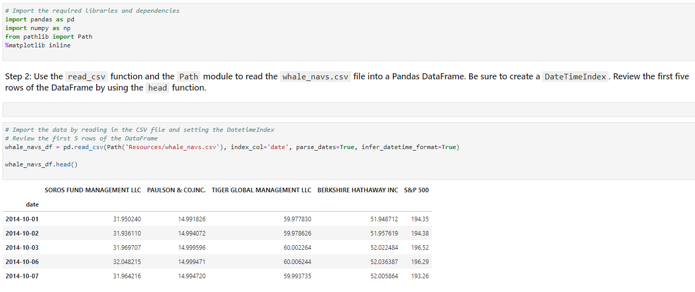
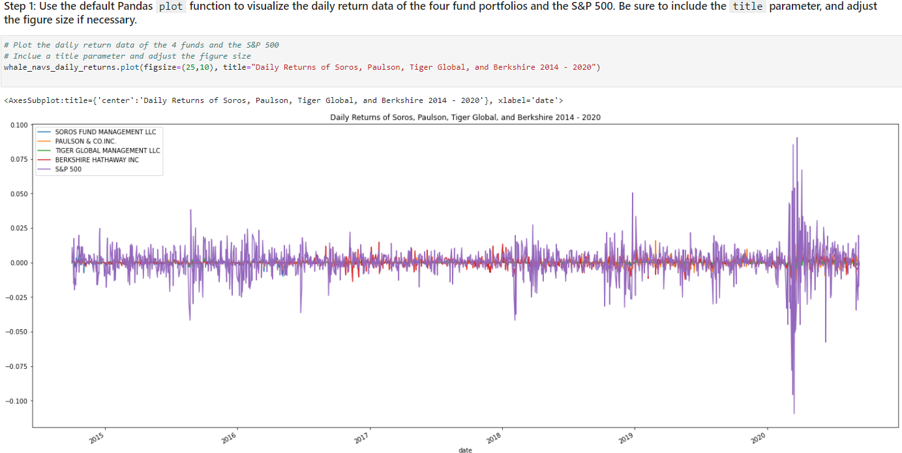
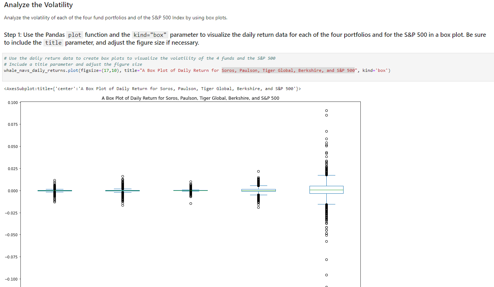
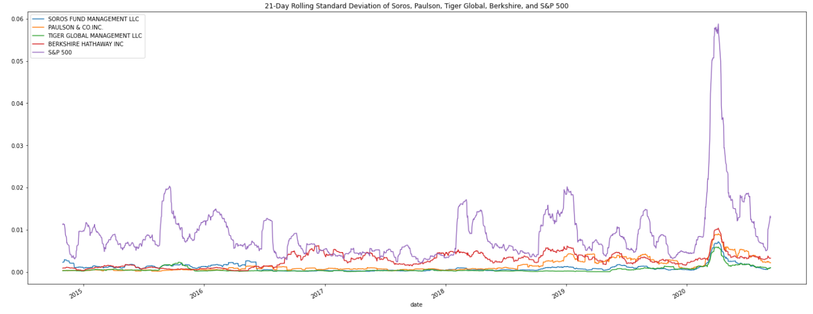
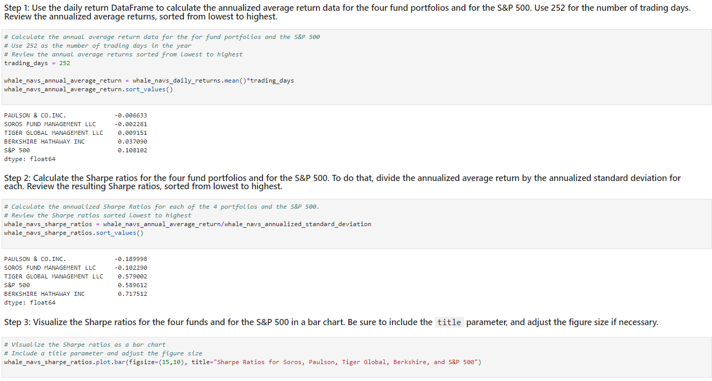
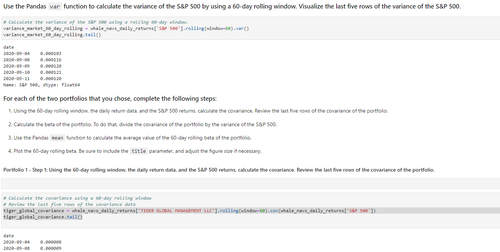

# Portfolio-Risk-and-Return
This platform aims to offer clients a one-stop online investment solution for their retirement portfolios that’s both inexpensive and high quality.

The platform determines the fund with the most investment potential based on key risk-management metrics: the daily returns, standard deviations, Sharpe rations, and betas.

---

## Technologies

This project leverages Anaconda and JupyterLab with Python 3.9:

* [Anaconda](https://www.anaconda.com/products/individual) 

Need to import the following libraries and dependencies:

```
import pandas as pd
import numpy as np
from pathlib import Path
%matplotlib inline
```

---

## Installation Guide

Before running the application first install the following dependencies.

1. Install [Anaconda](https://www.anaconda.com/products/individual) from link 
2. Open up GitBash(Windows) or Terminal(Mac)
3. Type ```conda update conda``` to update Conda
4. Type ```conda update anaconda``` to update Anaconda
5. Type ```conda create -n dev python=3.9 anaconda```
6. Type ```conda activate dev``` to activate conda
7. Install a dev environment kernel by typing ```python -m ipykernel install --user --name dev```
8. Install a node environment by typing ```conda install -c conda-forge nodejs```
9. Launch JupyterLab by typing ```jupyter lab```


---

## Usage

You will need to clone the repo so that you can run the application:

```
 git clone https://github.com/locthai2002/Portfolio-Risk-and-Return.git
```

Here are some screenshots from running the application:

### Import the Data



### Analyze the Performance



### Analyze the Volatility



### Analyze the Risk



### Analyze the Risk-Return Profile



### Diversify the Portfolio



---

## Contributors

Loc Thai -- www.linkedin.com/in/loc-thai-69b8a2141
Phone: 415.400.9998

---

## License

MIT
